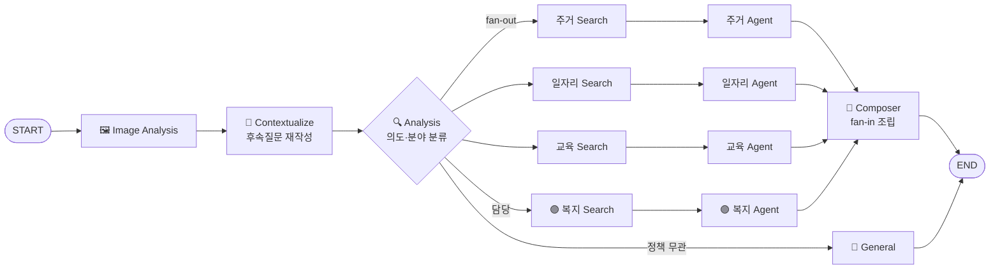

<h1>🍇 온통청년 API 기반 RAG 청년정책 챗봇</h1>

> "물어보면 찾아주는 것을 넘어, **내 조건에 맞는 정책을 판정해주는** AI 정책 상담 챗봇"
> 온통청년 공공 API를 RAG로 임베딩하고, LangGraph 멀티 에이전트가 분야별로 정책을 검색·추천·자격진단하는 대화형 서비스입니다.

---

## 📅 프로젝트 정보

- **진행 기간**: 2026.06.16 ~ 2026.06.30 (약 2주)
- **팀 구성**: **4명 (Backend / Frontend 겸업)** — 도메인별 전문 에이전트 1인 1담당
- **나의 담당 도메인**: **복지문화(Welfare) 전문 에이전트 + 데이터 임베딩 파이프라인 + 회원 인증**
- **핵심 타겟**: 흩어진 청년 정책 정보를 한 번에 찾고, 내 자격 여부까지 확인하고 싶은 청년
- **주요 가치**: 단순 검색이 아닌 **프로필 기반 자격 판정 + 맞춤 추천**을 제공하는 상담형 챗봇

### 🔗 Links

- **Backend**: [github.com/qqqkyj/rag-doc-chatbot](https://github.com/qqqkyj/kosa-rag-doc-chatbot)
- **Frontend**: [github.com/qqqkyj/rag-doc-chatbot-frontend](https://github.com/qqqkyj/kosa-rag-doc-chatbot-frontend)

---

## 🛠 기술 스택

### Backend / AI


### Data / Infra


### Frontend


### 선택 이유

- **LangGraph + LangChain**: 단일 체인으로는 4개 도메인 **병렬 분기(fan-out)** 와 노드 간 **상태 공유**, 후속질문 분기를 처리하기 어려워 **그래프 기반 오케스트레이션(LangGraph)** 을 채택하고, 각 노드 내부의 검색·임베딩·툴 호출은 **LangChain 컴포넌트**로 조립.
- **PostgreSQL + pgvector**: 대화 이력(체크포인트)과 정책 벡터를 **하나의 DB**에서 관리해 인프라를 단순화하고, 비동기(`async`) 유사도 검색으로 응답 지연 최소화.
- **FastAPI (async)**: 공공 API 대량 수집·임베딩·LLM 호출 등 I/O 바운드 작업이 많아 비동기 처리로 처리량 확보.

---

## 🏗 시스템 아키텍처 (LangGraph Workflow)



> **검색·생성 분리 구조**: 각 도메인은 `Search Node(RAG 검색)` → `Domain Agent(LLM 생성)` 로 나뉘어, 검색(결정적)과 생성(LLM)의 책임을 분리했습니다. 🟣 표시가 제가 담당한 **복지(Welfare) 경로**입니다.

---

## 🌟 핵심 기능 및 역할 (Technical Contributions)

## 🧑‍💻 강연주 (나의 역할) — Welfare Agent / Data Pipeline / Auth

### 🔹 복지문화 도메인 전문 에이전트

- **검색·생성 노드 분리 구현**: `welfare_search_node`(PGVector 유사도 검색 + 임계값 필터)와 `welfare_agent`(LLM 답변 생성)를 분리해 검색 정확도와 생성 품질을 독립적으로 튜닝.
- **하이브리드 검색 라우팅**: 벡터 검색 결과가 **5건 미만이면 Tavily 실시간 웹 검색으로 자동 보충**, 상세조회는 1건 기준으로 과보충 방지.
- **프로필 맞춤 답변**: 로그인 사용자 프로필을 시스템 프롬프트에 주입하고, 대화 중 언급된 프로필 항목(나이·지역·소득 등)을 **자동 추출·병합**.

### 🔹 복지 자격진단 Tool (특화 기능)

- **6대 요건 정밀 검증**: 연령·지역·혼인·취업·소득·학력을 사용자 프로필과 정책 데이터 간 **1:1 교차 매핑**하여 판정.
- **보수적 3-State 판정**: `충족 ✅ / 미충족 ❌ / 확인불가 ⚠️` 3단계로 판정하여 **오판정(False Positive) 차단**.
- **조건부 매칭 알고리즘**: 소득 요건 `원 → 만원` 단위 환산, 지역 요건 `전북 / 전라북도 / 전북특별자치도` 양방향 부분매칭 파싱.

### 🔹 데이터 수집 · 임베딩 파이프라인

- **온통청년 Open API 전량 수집**: `httpx` 비동기 페이지네이션으로 복지문화 분야 정책을 전량 수집.
- **Human-Readable 변환**: API 원시 코드값을 매핑 테이블 기반 **한글 명칭으로 치환**.
- **청킹 & 적재**: `RecursiveCharacterTextSplitter(500/100)` 청킹 + 중복 제거 후 **OpenAI Embedding → PGVector 비동기 저장**.
- **단일 엔드포인트 자동화**: `POST /upload/youth-policy` 한 번으로 수집→변환→분할→적재를 일괄 처리.

### 🔹 회원 인증 & 공통 도구

- **회원 프로필 시스템**: 가입·조회·삭제 REST API를 **Controller-Service 계층**으로 구현, Pydantic 유효성 검증 및 자격진단 6개 항목의 기준 데이터로 연동.
- **공통 유틸 통합**: 도메인마다 중복되던 **만나이 계산 / D-day(신청 마감) 계산** 로직을 공용 모듈로 통합, `상시접수 / 마감 / D-N` 라벨 정규식 자동 추출.

---

## 🧑‍💻 팀원 협업

- **김민지** — 교육 도메인 에이전트(학점 필터 툴), 공통 기능(이미지 분석, Composer 조립 패턴, 챗봇 메인 엔드포인트 및 대화 기록 저장/조회/삭제)
- **김정원** — 주거 도메인 에이전트, Supervisor 의도 분석 · 라우팅(fan-out/fan-in), 소득분위 추정 툴
- **이지예** — 일자리 도메인 에이전트

---

## 🔥 Trouble Shooting

### 1️⃣ 공공 API 공식 명세와 실제 응답의 불일치

> **Key Concepts:** API Spec Validation, Defensive Parsing, Pagination

**[문제]** 온통청년 API 공식 문서(oaiDoc)대로 파라미터를 넣었으나 데이터가 0건 반환되거나 특정 필드가 누락됨.

- **원인:** 공식 명세와 실제 응답이 달랐음.
  - 인증키 `openApiVlak` → 실제 `apiKeyNm`, 페이지 `pageIndex/display` → `pageNum/pageSize`
  - 응답이 최상위가 아니라 `result.youthPolicyList` 안에 한 단계 감싸져 있음
  - 특화요건 필드가 대소문자 민감(`sBizCd` vs `sbizCd`)
- **해결:** 실제 호출 결과를 문서와 대조·검증하여 파라미터·응답 파싱을 재정의하고, `result.pagging.totCount` 기준으로 전체 페이지를 순회하되 **빈 페이지가 나오면 안전 종료**하는 이중 방어 루프 설계. 대소문자 필드는 `policy.get("sBizCd") or policy.get("sbizCd")` 로 양쪽 대응.
- **결과:** 수백~천 건 단위 정책 데이터를 누락 없이 안정적으로 전량 수집·임베딩.

### 2️⃣ 자격진단의 잘못된 "적합" 판정 (False Positive)

> **Key Concepts:** Conservative Evaluation, 3-State Verdict, Data Integrity

**[문제]** 정책·프로필 데이터가 비어 있는데도 "자격 충족"으로 잘못 안내되는 위험.

- **원인:** 조건값이 없을 때 이를 "제한 없음 = 충족"으로 단정하면, 실제로는 중위소득% 등 별도 조건이 있는 정책까지 통과 처리됨.
- **해결:** 판정을 `충족 / 미충족 / 확인불가` **3-State**로 설계. 소득 조건이 `기타`(연소득 외 수치 판정 불가)이거나 사용자 값이 없으면 **단정하지 않고 `확인불가(⚠️)` 로 처리**. 하나라도 미충족이면 나머지가 충족이어도 `부적격` 확정.
- **결과:** "된다고 했는데 안 되는" 최악의 오안내를 원천 차단하고, 사용자에게 **정직한 판정 근거**를 제공.

### 3️⃣ RAG 검색 공백 (관련 정책이 없을 때)

> **Key Concepts:** Hybrid Search, Fallback Routing, Similarity Threshold

**[문제]** 벡터 DB에 관련 정책이 적거나 없을 때 빈 답변 또는 빈약한 답변이 나감.

- **원인:** 임베딩된 정책만으로는 신규·틈새 질의를 모두 커버할 수 없음.
- **해결:** 검색 결과가 임계값 필터 후 **5건 미만이면 Tavily 실시간 웹 검색으로 자동 보충**하는 하이브리드 라우팅 구현. 단, 상세조회는 특정 1개 정책에 집중하므로 1건 기준으로 낮춰 **불필요한 웹 패딩을 방지**.
- **결과:** 검색 커버리지를 넓히면서도 RAG 결과를 우선 노출해 답변 신뢰도와 커버리지를 동시에 확보.

### 4️⃣ 회원 삭제 시 대화 이력 고아 데이터

> **Key Concepts:** LangGraph Checkpoint, Cascade Cleanup, Thread Isolation

**[문제]** 회원 탈퇴 시 유저 레코드만 지우면 LangGraph 대화 체크포인트가 DB에 그대로 남음.

- **원인:** 대화 이력이 `thread_id = "{user_id}:{conversation_id}"` 형식으로 별도 테이블(`checkpoints`, `checkpoint_blobs`, `checkpoint_writes`)에 저장되어 유저 테이블과 FK로 묶여 있지 않음.
- **해결:** 회원 삭제 트랜잭션에서 `thread_id LIKE '{user_id}:%'` 조건으로 **연관 체크포인트 3개 테이블을 함께 정리**한 뒤 유저를 삭제.
- **결과:** 개인정보/대화 데이터 잔존 없이 깔끔하게 삭제, DB 정합성 유지.

---

## 📊 핵심 성과 및 차별점

- **검색을 넘어선 판정**: 단순 RAG 검색이 아닌 **6대 요건 기반 자격진단**으로 "내가 받을 수 있는지"까지 답하는 상담형 챗봇.
- **정직한 AI**: 보수적 3-State 판정으로 근거 없는 "적합" 판정을 차단 — 신뢰도 중심 설계.
- **안정적 데이터 파이프라인**: 공공 API 명세 검증 + 이중 방어 수집 루프로 대량 정책을 누락 없이 임베딩.
- **하이브리드 검색**: 벡터(PGVector) + 실시간 웹(Tavily)으로 검색 공백 보완.
- **확장 가능한 구조**: LangGraph 멀티 에이전트로 도메인 추가/교체가 용이한 아키텍처.

---

## 🔮 Future Roadmap

- **실시간 정책 동기화 스케줄러**: 온통청년 API 갱신 주기에 맞춘 자동 재임베딩 배치 구축.
- **성능 최적화**: 임베딩·검색 결과 캐싱(Redis) 및 부하 분산으로 대량 동시 접속 대응.
- **자격진단 고도화**: 중위소득% 등 텍스트형 소득 조건의 정량 파싱 확장.

---

## ⚙️ 실행 방법 (Quick Start)

### 1) 환경 변수 (.env)

| 변수명 | 설명 |
| --- | --- |
| `OPENAI_API_KEY` | OpenAI API 키 (임베딩 / LLM) |
| `YOUTH_API_KEY` | 온통청년 Open API 인증키 |
| `TAVILY_API_KEY` | Tavily 웹 검색 API 키 |
| `DATABASE_URL` | PostgreSQL(pgvector) 연결 문자열 |

### 2) 인프라 & 서버 실행

```bash
# PostgreSQL(pgvector) 컨테이너 기동
docker compose up -d

# 의존성 설치 & 서버 실행
pip install -r requirements.txt
uvicorn main:app --reload
```

### 3) 정책 데이터 임베딩 (최초 1회)

```bash
# 온통청년 API 수집 → 변환 → 청킹 → PGVector 적재
curl -X POST http://localhost/upload/youth-policy \
  -F "lclsf_nm=복지문화"
```

- API 문서(Swagger): `http://localhost/docs`
